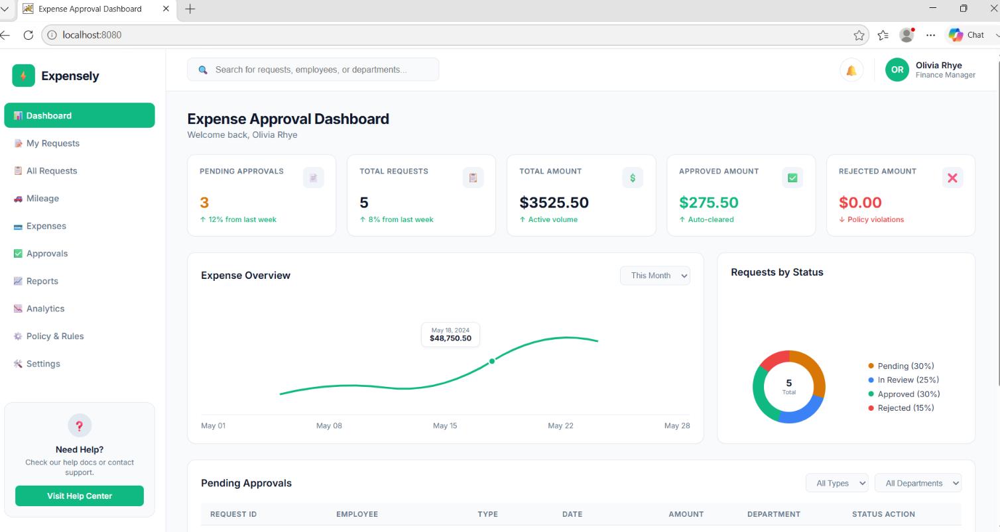

# 🛡️ Policy-Driven Approval Agent

### Explainable, Rule-Based Expense Approval System built with Pure Java

A lightweight **policy-driven approval engine** that converts plain-English business rules into executable policies and automatically evaluates expense claims.

The system produces one of three decisions:

**✅ APPROVE · ❌ REJECT · ⚠️ ESCALATE**

Every decision includes a **traceable rationale** explaining exactly which business rule produced the result.

> **No AI/LLM dependency. No database. No external libraries. Just Java + configurable business rules.**

---

## 🎥 Project Demo

https://drive.google.com/file/d/1iy3qK7PYlBHag6A_osnvSaabma6WEpGu/view?usp=drivesdk

The demo shows the dashboard, policy configuration, expense evaluation, and approval/rejection/escalation decisions.

---

## 📊 Application Dashboard

The project includes a lightweight browser-based dashboard for interacting with the approval engine.



### Dashboard capabilities

- 📋 View configurable business rules
- 📊 Evaluate expense claims
- ✅ Automatic approvals
- ❌ Policy-based rejections
- ⚠️ Human-review escalations
- 🔎 View matched-rule rationale
- 🔄 Update policies without modifying Java source code

---

# 💡 Why This Project?

In real organizations, expense approvals are controlled by changing business policies.

For example:

> **"Auto-approve expenses under $500 for Sales."**

Instead of hard-coding this logic directly into Java, this project treats approval policies as **configuration**.

Business rules are stored in:

```text
rules.txt
